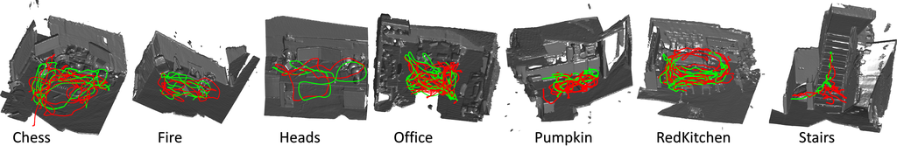

# Microsoft 7-Scenes dataset parser for publishing ROS2 messages

This package takes care of reading  icrosoft 7-Scenes dataset sequences and publishing ROS" compatible messages for algorithm testing:


## Published Topics

`\cloud_in`

The topic carries the pointcloud ontained from RGB and Depth image pairs (for now only XYZ)

`\cv_image`

The original RGB image correspoing to the pointcloud 

## Provided transforms


```
sensor data frame → /map
```

# How to use

1. First download any of the datasats found in [The official Website](https://www.microsoft.com/en-us/research/project/rgb-d-dataset-7-scenes/)

    * Chess Dataset: `cd ~/Downloads && wget https://www.microsoft.com/en-us/research/project/rgb-d-dataset-7-scenes/` 
    * Fire Dataset `cd ~/Downloads && wget http://download.microsoft.com/download/2/8/5/28564B23-0828-408F-8631-23B1EFF1DAC8/fire.zip`
    * Heads Dataset `cd ~/Downloads && wget http://download.microsoft.com/download/2/8/5/28564B23-0828-408F-8631-23B1EFF1DAC8/heads.zip`
    * Office Dataset `cd ~/Downloads && wget http://download.microsoft.com/download/2/8/5/28564B23-0828-408F-8631-23B1EFF1DAC8/office.zip`
    * Pumpkin Dataset `cd ~/Downloads && wget http://download.microsoft.com/download/2/8/5/28564B23-0828-408F-8631-23B1EFF1DAC8/pumpkin.zip`
    * RedKitchen dataset: `cd ~/Downloads && wget http://download.microsoft.com/download/2/8/5/28564B23-0828-408F-8631-23B1EFF1DAC8/redkitchen.zip`
    * Stairs Dataset: `cd ~/Downloads && wget http://download.microsoft.com/download/2/8/5/28564B23-0828-408F-8631-23B1EFF1DAC8/stairs.zip`


2. Download the package into the src directory of your ros2_ws 

```bash

git clone && colcon build --packages-select microsoft7scenes --symlink-install 

```

3. Go back to the ros2_ws and build

```bash

cd ~/ros2_ws && colcon build --symlink-install  --packages-select microsoft7scenes 
```

2. Navigate to  ~/ros2_ws/microsoft7scences/params/params.yaml file and modify the `dataset_path` parameter wth the absolute path of your dataset sequence to use (folder with format seq-XX where XX is the sequence number).

3. You can launch the dataset by itself

```
ros2 launch microsoft7scenes launch_dataset.launch.py 
```

4. Or you can launch it with RViz2 for visualization

```
ros2 launch microsoft7scenes launch_dataset_rviz.launch.py 
```


